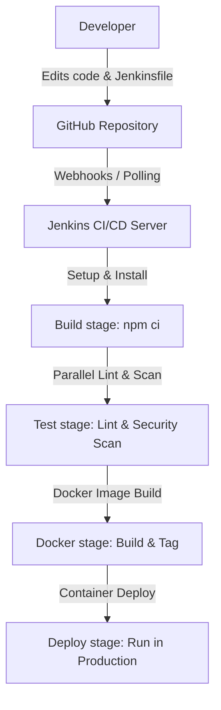

# Ninja Reverse Proxy

A production-grade Reverse Proxy built from scratch using **TypeScript** and **Node.js** — featuring cluster architecture, Redis caching, auto scaling, rate limiting, health checks, service registry, and full Docker support.

---

## Project Overview

**Ninja Reverse Proxy** is a high-performance, resilient, and configurable reverse proxy server. Designed to handle large volumes of web traffic, it utilizes a Node.js cluster (Master-Worker) model to distribute workloads across all available CPU cores. Features such as Redis caching, token-bucket/sliding-window rate limiting, service registries, and auto-scaling upstream backends make it suitable for modern cloud-native architectures. The project includes automated CI/CD pipelines, static analysis, containerization, and security vulnerability scanning tools to ensure production-grade quality and safety.

---

## Architecture

### System Architecture
The reverse proxy operates on a Master/Worker architecture:
*   **Master Process**: Acts as the central controller, binding to ports, validating config files via Zod, managing Redis caches, running continuous health checks, and dynamically scaling upstreams.
*   **Worker Processes**: Handle active TCP connections. When a request arrives, the load balancer selects a worker using a Round-Robin strategy. The worker proxies the request to one of the active upstream servers.

### CI/CD Deployment Flow
The pipeline follows a GitOps flow from developer commits to deployment:



---

## Features

| Feature | Details |
|---|---|
| Cluster Architecture | Master/Worker pattern via Node.js `cluster` module |
| Round Robin Load Balancing | Equal request distribution across upstream servers |
| Redis Caching | GET response caching with configurable TTL |
| Cache Invalidation | Auto-invalidate on POST / PUT / PATCH / DELETE |
| Rate Limiting | Per-route sliding window (per client IP) |
| Auto Scaling | Dynamically spins up/down upstream servers based on load |
| Service Registry | Upstreams self-register, deregister, and send heartbeats |
| Health Checks | Initial + continuous health monitoring of backends |
| HTTPS / SSL Termination | Self-signed or CA cert support at proxy level |
| HTTP → HTTPS Redirect | All plain HTTP traffic auto-redirected (301) |
| Auto Worker Replacement | Crashed workers instantly replaced by master |
| Request Timeout | 20s master timeout + 15s upstream timeout |
| Retry Logic | Up to 2 retries on upstream failure (different worker each time) |
| Graceful Shutdown | Drains connections cleanly on SIGTERM / SIGINT |
| Admin Endpoints | Live stats for LB, cache, registry, auto scaler |
| All HTTP Methods | GET, POST, PUT, PATCH, DELETE |
| YAML Configuration | Single config file with full Zod schema validation |
| Docker Support | One command to run everything |

---

## Tech Stack

| Technology | Purpose |
|---|---|
| TypeScript | Full type safety |
| Node.js Cluster | Multi-process master/worker architecture |
| Redis | Response caching |
| Zod | Schema validation for config + messages |
| YAML | Human-readable configuration |
| Commander | CLI entry point |
| Docker Compose | Full stack orchestration |
| k6 | Load testing |
| Jenkins | Continuous Integration & Delivery (CI/CD) |
| SonarQube | Continuous Code Quality and Static Analysis |
| Trivy | Container & Dependency Security Scanner |

---

## Project Structure

```
.
├── src/
│   ├── index.ts              → Entry point, CLI (Commander)
│   ├── server.ts             → Main proxy logic (master + worker)
│   ├── config.ts             → YAML parser
│   ├── config-schema.ts      → Zod schema for config validation
│   ├── server-schema.ts      → Zod schema for worker message types
│   ├── health.ts             → Initial + continuous health check functions
│   ├── rate-limiter.ts       → Per-route sliding window rate limiter
│   ├── loadBalancer.ts       → Round-robin load balancer with failure tracking
│   ├── cache.ts              → Redis cache (get, set, invalidate, stats)
│   ├── auto-scaler.ts        → Dynamic upstream scaling logic
│   └── Serviceregistry.ts    → Service registry (register, deregister, heartbeat)
│
├── Jenkinsfile               → Declarative Jenkins CI/CD pipeline
├── sonar-project.properties  → SonarQube analysis configuration
├── .dockerignore             → Docker build context exclusions
├── Dockerfile                → Multi-stage build specification
├── Dockerfile.server         → Dockerfile for mock upstream servers
├── docker-compose.yml        → Full stack: proxy + Redis + upstream servers
├── config.yaml               → Proxy configurations
├── key.pem / cert.pem        → SSL certificates (generated locally)
├── package.json              → Dependency manifests and scripts
└── test.js                   → k6 load testing script
```

---

## Configuration

```yaml
server:

  listen: 8080          # HTTP port (redirects to HTTPS)
  httpsPort: 8443       # HTTPS port (main entry point)
  workers: 2            # Match your CPU core count (nproc)

  loadBalancing:
    strategy: round-robin
    failureThreshold: 3       # Mark upstream DOWN after 3 failures
    recoveryTimeMs: 15000     # Try recovery after 15 seconds

  autoScaling:
    enabled: true
    minServers: 2
    maxServers: 4             # Keep low on i3/i5 hardware
    scaleUpAt: 3
    scaleDownAt: 1
    cooldownMs: 60000
    startPort: 9000
    proxyPort: 8080

  cache:
    enabled: true
    host: redis
    port: 6379                # Official Redis port
    ttlSeconds: 60

  upstreams:
    - id: node1
      url: http://node1:8001
    - id: node2
      url: http://node2:8002
    - id: node3
      url: http://node3:8003
    - id: node4
      url: http://node4:8004

  paths:
    - path: /
      upstream:
        - node1
        - node2
        - node3
        - node4
      rateLimit:
        windowMs: 60000
        maxRequests: 1000000

    - path: /admin
      upstream:
        - node2
        - node3
        - node4
      rateLimit:
        windowMs: 60000
        maxRequests: 1000000

  headers:
    - key: X-Forwarded-For
      value: client_ip
    - key: X-Real-IP
      value: client_ip
```

> **Workers warning** — setting `workers` higher than your CPU core count causes context switching and system hangs. Run `nproc` to check your core count.

---

## Installation

```bash
# 1. Clone the repo
git clone https://github.com/praveenkumar-co/reverse-proxy.git
cd reverse-proxy

# 2. Install dependencies
pnpm install

# 3. Generate SSL certificate (development only)
openssl req -x509 -newkey rsa:4096 \
  -keyout key.pem -out cert.pem \
  -days 365 -nodes
```

---

## Docker Instructions

### Multi-Stage Build
The application uses a multi-stage `Dockerfile` to optimize the final image size and reduce security vulnerabilities:
1.  **Build Stage**: A Node.js Alpine base image is used to install all dependencies (including devDependencies) and build the TypeScript files into compiled JavaScript files in the `dist` folder.
2.  **Runtime Stage**: A fresh Node.js Alpine image is initialized. Only production dependencies are installed (using `npm ci --omit=dev`), and the compiled `dist` directory is copied over.

This results in a clean, small, and fast containerized proxy server.

### Orchestration with Docker Compose
The environment includes the proxy server, a Redis caching instance, and multiple Node.js backend nodes.

```bash
# Start everything in the foreground — proxy + Redis + all upstream servers
docker-compose up --build

# Run in background (detached mode)
docker-compose up --build -d

# Check running container statuses
docker-compose ps

# View real-time logs
docker-compose logs -f

# Stop and clean up all resources
docker-compose down
```

---

## Jenkins CI/CD Pipeline Explanation

The project includes a `Jenkinsfile` that defines a **Declarative Pipeline** for automating the integration and deployment stages.

### Pipeline Stages
1.  **Setup**: Prepares the build environment by checking credentials and installing dependencies using `npm ci`.
2.  **Static Analysis**: Runs two parallel sub-stages to save time:
    *   **Lint**: Checks code formatting and styling rules.
    *   **Security Scan**: Checks package dependencies for vulnerabilities (`npm audit`).
3.  **Unit Tests**: Executes automated test suites (conditional on parameter `RUN_TESTS`).
4.  **Build Artifact**: Compiles TypeScript files into production-ready JavaScript code.
5.  **Deploy to Production**: Performs a production deployment (conditional on the `main` branch and `ENV_TYPE` set to `prod`), with an interactive confirmation prompt (`input`).

### Pipeline Features
*   **Global Options**: Prevents simultaneous builds using `disableConcurrentBuilds()`, enforces a 1-hour timeout, and keeps only the last 10 builds via `buildDiscarder`.
*   **Post Actions**: Cleans workspaces (`cleanWs()`), and provides visual logging for successful or failed states.

---

## SonarQube Integration

Continuous code quality monitoring is configured via the `sonar-project.properties` file.

### Metrics Analyzed
*   **Code Quality**: Measures bugs, vulnerabilities, and code smells.
*   **Coverage & Duplication**: Checks for code duplication metrics to ensure a dry and maintainable codebase.
*   **Exclusions**: Excludes vendor directories (`node_modules`), build directories (`dist`), and security credentials (`key.pem`, `cert.pem`) to focus strictly on custom TypeScript files in the `src/` directory.

### Running SonarQube Scanner
To trigger a manual scan, use the Sonar Scanner CLI:
```bash
sonar-scanner \
  -Dsonar.host.url=http://localhost:9000 \
  -Dsonar.login=YOUR_SONAR_TOKEN
```

---

## Trivy Security Scanning

To ensure secure infrastructure and dependencies, **Trivy** is used to scan both filesystem files and Docker container images.

### Scanning Dependencies (Filesystem)
Scan the repository dependencies for CVEs:
```bash
trivy fs .
```

### Scanning Docker Images
Scan the compiled container image before deploying it:
```bash
# Build the local Docker image
docker build -t ninja-reverse-proxy:latest .

# Run the Trivy scanner
trivy image ninja-reverse-proxy:latest
```
Trivy checks the base image and npm dependencies against the latest vulnerability databases to flag any issues before production releases.

---

## Running Manually (Without Docker)

```bash
# Terminal 1 — Backend server 1
node server1.js

# Terminal 2 — Backend server 2
node server2.js

# Terminal 3 — Reverse Proxy
pnpm dev
```

---

## Testing

```bash
# Basic GET
curl http://localhost:8080/

# HTTPS GET (skip cert verification for self-signed)
curl -k https://localhost:8443/

# POST request
curl -k -X POST https://localhost:8443/ \
  -H "Content-Type: application/json" \
  -d '{"name": "Ninja"}'

# Admin route
curl -k https://localhost:8443/admin

# Load test with k6
k6 run loadtest.js
```

---

## Admin Endpoints

| Endpoint | Method | Description |
|---|---|---|
| `/__lb-stats` | GET | Load balancer stats + healthy upstreams |
| `/__cache-stats` | GET | Redis cache hit/miss stats |
| `/__registry` | GET | All registered services |
| `/__autoscaler-stats` | GET | Auto scaler status |
| `/__registry/register` | POST | Register a new upstream |
| `/__registry/deregister/:id` | DELETE | Deregister an upstream |
| `/__registry/heartbeat/:id` | PUT | Upstream heartbeat ping |

```bash
# Example
curl -k https://localhost:8443/__lb-stats
curl -k https://localhost:8443/__cache-stats
curl -k https://localhost:8443/__registry
```

---

## Request Lifecycle

1.  Client sends request to `:8080` or `:8443`
2.  HTTP traffic gets **301 redirected** to HTTPS
3.  **Rate limiter** checks client IP against route limit — blocks with `429` if exceeded
4.  For **GET** requests — Redis cache checked. Cache HIT returns response instantly
5.  For **write** requests — cache invalidated for that path
6.  Request body collected in **chunks** and assembled
7.  `dispatchToWorker()` called — load balancer picks next upstream
8.  A **worker process** receives the enriched payload via IPC
9.  Worker validates the route, opens **keepAlive TCP connection** to upstream
10. Upstream responds — worker sends reply back to master
11. Master caches the response (GET) and **sends response to client**
12. On failure — load balancer records failure, retries up to **2 times**

---

## Heartbeat & Health System

Upstreams stay alive by sending periodic `PUT /__registry/heartbeat/:id` requests.

*   **Initial health check** — run at startup before accepting traffic (3s boot delay)
*   **Continuous health checks** — run every 10 seconds during operation
*   **Auto-removal** — unresponsive upstreams removed from load balancer rotation
*   **Auto-recovery** — upstreams re-added after `recoveryTimeMs` (15s default)

---

## Security Features

| Feature | Details |
|---|---|
| HTTPS | SSL termination at proxy, HTTP auto-redirected |
| Rate Limiting | Per-IP, per-route sliding window |
| X-Forwarded-For | Real client IP forwarded to upstreams |
| X-Proxy-By | `Ninja-Reverse-Proxy` header on all proxied requests |
| Request Timeout | 20s master + 15s upstream timeout |
| Graceful Shutdown | No requests dropped on restart |

---

## Performance Tips

*   Set `workers` = output of `nproc` (never exceed core count)
*   Keep `maxServers` in autoScaling low on limited hardware (3–4 for i3)
*   Redis TTL of 60s works well for mostly-read APIs
*   Use `keepAlive: true` (already set) — avoids TCP handshake per request
*   Monitor `/__lb-stats` to see which upstreams are under load

---

## Contributing

Pull requests are welcome! Please open an issue first to discuss major changes.

---

## License

MIT